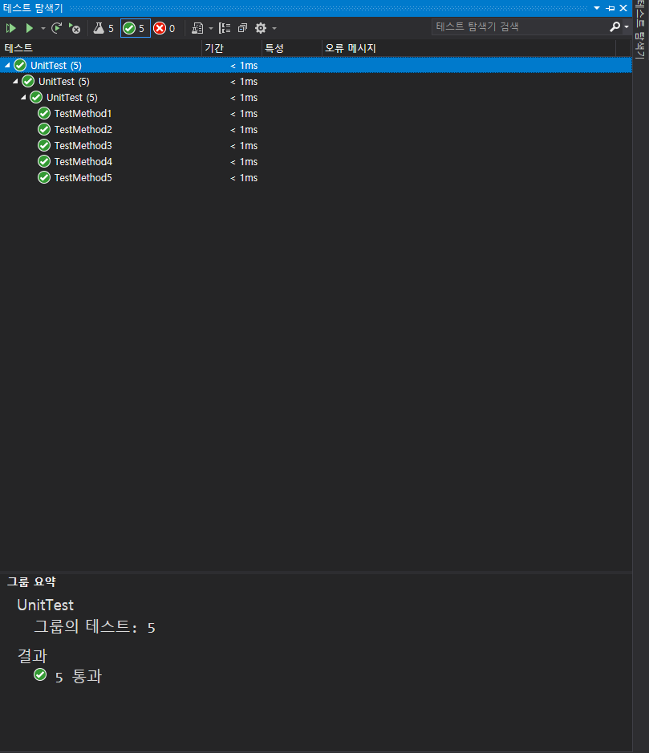

# 4_3 왕실의 나이트 문제
[문제 링크](https://freedeveloper.tistory.com/272?category=888096)
# 생각한 풀이 방법
현재 나이트 위치를 8x8 맵 위치로 변환 시켜, 이동 가능한 모든 경우의 8가지를 저장해놓고 맵을 벗어날 때의 수는 포함시키지 않는다.
## 풀면서
로직을 생각하는 것 보다 이동가능한 경우의 수 8가지 입력과 문자 "a to h" 까지의 숫자 변환이 더 귀찮고 힘들었다. 

좋은 방법은 [여기](https://github.com/fora22/CodingTest/blob/master/jongfeel/KnightOfKingdom/README.md)에 있는 방법인데 문자는 ASCII 코드로 정해져 있으므로 문자를 쉽게 숫자로 변환할 수 있다.

Hash Map을 통해 푸는 방법도 있는데 그것도 [위 링크](https://github.com/fora22/CodingTest/blob/master/jongfeel/KnightOfKingdom/README.md) 참조 바람.

# UnitTest

성공~!!
