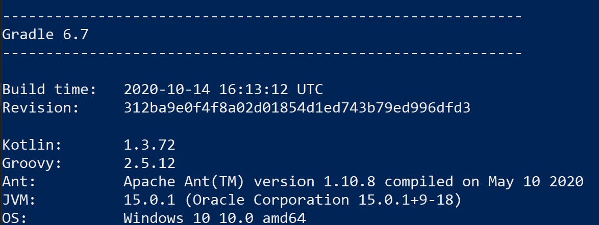
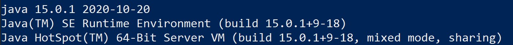

# 왕실의 나이트

문제는 아래 링크 참조

[세영님이 올린 문제](https://github.com/fora22/Coding_Test/tree/JSY8869/Feature/CodingTest/Practice/4_2/JSY8869/CHAPTER%204/%EC%8B%A4%EC%A0%84%204-1)

## Development Environment

### gradle 6.7



### java 15.0.1



## Build, Run, Test

``` shell
$ gradle build
```

``` shell
$ gradle run
```

``` shell
$ gradle test
```

## Analysis

문제에는 나이트의 이동 경로를 친절히 설명해 주고 있지만 결국 8x8 체스 판 위에 나이트가 움직일 수 있는 범위는 계산하지 않아도 정해져 있다는 걸 파악할 수 있다.

아래 그림과 같이 각 체스판 위치마다 나이트가 이동할 수 있는 경우의 수를 구할 수 있고 a1 - d4 까지만 봐도 좌우 및 상하 대칭값이라는 걸 알 수 있다.


그러므로 칸의 값을 입력받지 않고 미리 나이트 이동 경우의 수가 담긴 64개의 mapping된 값만 가지고 있다면 계산할 필요가 없다는 결론에 도달할 수 있다.

## Design

각 칸 마다 이동 경우의 수 값이 들어갈 수 있는 HashMap 객체를 생성한다.

key는 "a1", "d4"와 같은 칸 이름이며
value는 이동 경우의 수이다.

``` java
private HashMap<String, Integer> knightMap = new HashMap<>();
```

이동 경우의 수는 a열, h열의 값이 같고 b열, g열의 값이 같으며\
나머지 c, d, e, f열의 값들도 같다.
따라서 이 값들을 int arrary로 아래와 같이 정의할 수 있다.

``` java
private int[] values_a_or_h = {2, 3, 4, 4, 4, 4, 3, 2};
private int[] values_b_or_g = {3, 4, 6, 6, 6, 6, 4, 3};
private int[] values_c_to_f = {4, 6, 8, 8, 8, 8, 6, 4};
```

이제 a to h 까지 8회\
1 to 8 까지 8회\
총 64회를 반복하며 칸의 값과 나이트 이동 경우의 수를 매핑한다.

> Tips - ASCII
>
> 컴퓨터를 모르는 사람은 ASCII 코드가 뭔지 모를 수 있으니 아래 링크를 참고해서 뭔지 확인해 보자.
> https://en.wikipedia.org/wiki/ASCII\
> 미국 표준 코드표 정도 되는데 각 숫자에 매핑되는 영문자, 숫자, 특수문자들이 표로 정해져 있다.

체스 칸의 a, b, c, d, e, f, g, h는 각각 ASCII 값으로 97, 98, 99, 100, 101, 102, 103, 104 값이다.

따라서 for 문을 작성할 경우 열의 경우 97 부터 104 까지 값을 가질 수 있게 하고\
행의 경우는 0 부터 7까지 값을 가질 수 있게 아래와 같이 구현한다.

총 64회를 돌면서 체스 보드 칸 이름을 만들 수 있게 된다.

``` java
// ASCII 97 is 'a', 104 is 'h'
for (int col = 97; col < 105; col++) {
    for (int row = 0; row < 8; row++) {
        //...
    }
}
```

숫자를 영문자로 변환하는 방법은 char type으로 캐스팅 하면 된다.

``` java
char colName = (char)col;
```

최종적으로 체스 보드 칸 이름 입력값에 따른 이동 경우의 수 메소드는 아래와 같이 간단한게 생각해 볼 수 있다.

``` java
public int moveTo(String squareName) {
    return knightMap.get(squareName);
}
```

## Unit test

칸 이름과 이동 경우의 수가 맞는지 체크하는 테스트 케이스 5개를 준비하고 각각 "a1", "h2", "b7", "g3", "e5"에 해당하는 이동 경우의 수 2, 3, 4, 6, 8을 파라미터 값으로 준비해 테스트를 진행한다.

테스트 결과는 /app/build/reports/tests/test/index.html 파일을 웹브라우저로 연다.

아래와 같이 5개의 test 케이스가 성공한 걸 확인할 수 있다.

